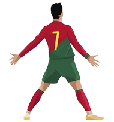

# Ronaldo Siuuu! Chrome Extension

[](https://chromewebstore.google.com/detail/ronaldo-siuuu-click-or-ct/ajjnpmpdkgkcfolnmkfjaeimhaebcpfn)
[](https://chromewebstore.google.com/detail/ronaldo-siuuu-click-or-ct/ajjnpmpdkgkcfolnmkfjaeimhaebcpfn)

A fun Chrome extension that plays Cristiano Ronaldo's iconic "Siuuu!" celebration sound with just a click or keyboard shortcut.



## 🎵 Features

- **One-Click Sound**: Click the extension icon to instantly hear Ronaldo's "Siuuu!" 
- **Keyboard Shortcut**: Press `Ctrl+Shift+S` (or `Cmd+Shift+S` on Mac) for quick access
- **Smart Error Handling**: Shows a helpful popup when sound can't be played on restricted pages
- **Works Everywhere**: Functions on any regular webpage
- **Privacy First**: No data collection, completely offline after installation

## 🚀 Installation

### From Chrome Web Store (Recommended)

**[📥 Install from Chrome Web Store](https://chromewebstore.google.com/detail/ronaldo-siuuu-click-or-ct/ajjnpmpdkgkcfolnmkfjaeimhaebcpfn)**

1. Click the link above or search for "Ronaldo Siuuu!" in the Chrome Web Store
2. Click "Add to Chrome" 
3. Confirm by clicking "Add extension"
4. Pin the extension to your toolbar for easy access

### From Source (Development)

1. **Clone or Download** this repository
2. **Open Chrome** and navigate to `chrome://extensions/`
3. **Enable Developer Mode** (toggle in top-right corner)
4. **Click "Load unpacked"** and select the extension folder
5. **Pin the extension** to your toolbar for easy access

## 🎮 Usage

### Method 1: Click the Icon
- Look for the Ronaldo extension icon in your Chrome toolbar
- Click it to play the "Siuuu!" sound instantly
- On restricted pages (like Chrome settings), a helpful popup will explain why the sound can't play

### Method 2: Keyboard Shortcut
- Press `Ctrl+Shift+S` (Windows/Linux) or `Cmd+Shift+S` (Mac)
- Works on any regular webpage
- On restricted pages, shows a popup with helpful information

## 📁 Project Structure

```
Ronaldo Siu Extension/
├── manifest.json       # Extension configuration
├── background.js       # Main extension logic
├── popup.html         # Error popup interface
├── popup.js           # Popup logic and auto-close
├── icon.png           # Default extension icon
├── siuuu.mp3         # Ronaldo's "Siuuu!" sound file
└── README.md         # This file
```

## 🛠️ Technical Details

- **Manifest Version**: 3 (latest Chrome extension standard)
- **Permissions**: 
  - `activeTab`: Interact with current webpage
  - `scripting`: Inject audio playback script
- **Service Worker**: Background script for handling icon clicks and shortcuts
- **Audio Playback**: Uses Web Audio API via content script injection
- **Error Handling**: Smart popup system that only appears when sound cannot be played

## 🔧 Development

### Prerequisites
- Google Chrome (latest version)
- Basic knowledge of JavaScript and Chrome Extension APIs

### Local Development
1. Make changes to the source files
2. Go to `chrome://extensions/`
3. Click the reload button (🔄) for the extension
4. Test your changes

### Debugging
- **Service Worker Console**: Go to `chrome://extensions/` → Find your extension → Click "Inspect views: service worker"
- **Content Script Console**: Open DevTools on any webpage where you're testing

## 🎨 Customization

### Changing the Sound
1. Replace `siuuu.mp3` with your desired audio file
2. Keep the same filename or update the reference in `background.js`
3. Supported formats: MP3, WAV, OGG

### Updating the Icon
1. Replace `icon.png` 
2. Recommended sizes: 16x16, 32x32, 48x48, 128x128 pixels
3. Format: PNG with transparency support

### Modifying the Keyboard Shortcut
1. Edit the `commands` section in `manifest.json`
2. Update the `suggested_key` values
3. See [Chrome Commands API](https://developer.chrome.com/docs/extensions/reference/commands/) for available key combinations

## 📋 Browser Compatibility

- ✅ Chrome (Manifest V3)
- ✅ Edge (Chromium-based)
- ❌ Firefox (different extension format)
- ❌ Safari (different extension format)

## 🐛 Troubleshooting

### Sound Not Playing
- Check if audio is muted in your browser/system
- If on a Chrome internal page (`chrome://`, `edge://`, etc.), you'll see a helpful popup explaining the limitation
- Try the extension on a regular website like Google, YouTube, or any news site
- Refresh the webpage and try again if needed


### Keyboard Shortcut Not Working
- Check if another extension is using the same shortcut
- Try the shortcut on a regular webpage (not Chrome settings pages)
- Reload the extension if you changed the shortcut

## 🤝 Contributing

1. Fork the repository
2. Create a feature branch (`git checkout -b feature/amazing-feature`)
3. Commit your changes (`git commit -m 'Add amazing feature'`)
4. Push to the branch (`git push origin feature/amazing-feature`)
5. Open a Pull Request

## 📄 License

This project is open source. Please ensure you have rights to use any audio files.

## ⚽ About

Created for football fans and Cristiano Ronaldo supporters who want to add some celebration to their browsing experience. 

**Siuuu!** 🎉

---

*This extension is not officially affiliated with Cristiano Ronaldo or any football organizations.*